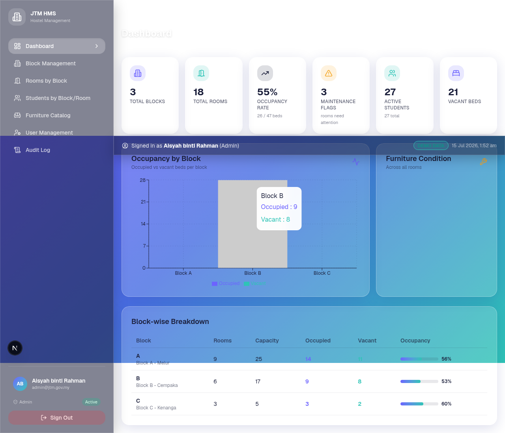

# JTM Hostel Management System (HMS)

A comprehensive, security-hardened Hostel Management System built for **Jabatan Tenaga Manusia (JTM), Malaysia**, to manage hostel/asrama operations across training institutes. Built strictly per the PRD with modern glassmorphism UI/UX.



## Features

### Core Modules (per PRD Section 5)
- **Authentication & User Management** — bcrypt-hashed passwords, role-based access (Admin / Warden / Facilities / Management), account lockout after 5 failed attempts
- **Block & Room Master Data** — full CRUD with auto-calculated occupancy
- **Room List by Block** — filterable (block / status / type / search), sortable, CSV/print export, color-coded status chips
- **Room Layout & Inventory** — schematic floor-plan canvas with positioned furniture icons colored by condition (Good=green, Fair=amber, Damaged/Missing=red), itemized inventory with inline edit, "Print Room Card" button
- **Student List by Block & Room** — cascading filters, allocate-to-room with capacity & gender-mismatch validation, check-out flow with history
- **Dashboard** — 6 summary cards, occupancy bar chart by block, furniture condition donut chart, per-block breakdown table
- **Furniture Catalog** — master item management grouped by category
- **Audit Log** — filterable, paginated, immutable record of all CREATE / UPDATE / DELETE / AUTH events

### Security Features (per PRD Section 6 & 8.8)
- **bcrypt password hashing** (12 rounds)
- **Secure sessions** — cryptographically random tokens, httpOnly + SameSite=Strict cookies, 8-hour TTL
- **Account lockout** — 15-min cooldown after 5 failed login attempts (audit-logged as critical)
- **Rate limiting** — 10 login attempts / IP / minute, 30 API requests / IP / minute
- **Row-Level Security (RLS) equivalent** — Wardens can only access rooms/students in their assigned blocks (server-side enforced)
- **Role-Based Access Control** — Admin (full) / Warden (own blocks) / Facilities (furniture write) / Management (read-only) / Viewer (read-only)
- **Audit logging** — every create/update/delete + all auth events recorded with user, IP, user-agent, severity
- **Input sanitization & validation** — control chars stripped, length-capped, email validated, password strength enforced (8+ chars, upper+lower+number+symbol)
- **Cascade-integrity checks** — can't delete block with rooms, room with active allocations, etc.
- **Capacity & bed-uniqueness enforcement** on allocations
- **Gender-mismatch prevention** on allocation (except Mixed blocks)

### UI/UX — Glassmorphism (per PRD Section 10)
- Frosted glass panels with `backdrop-filter: blur(16px)`
- Violet-to-teal gradient background (`#6C63FF → #2EC4B6`)
- Deep navy text (`#1B1F3B`)
- Rounded geometry (16-24px cards, 12px buttons)
- Soft shadows and 200-300ms transitions
- Responsive (desktop-first, tablet-friendly, mobile sidebar)
- WCAG-AA contrast on all surfaces

## Tech Stack
- **Framework**: Next.js 16 (App Router) + TypeScript 5
- **Styling**: Tailwind CSS 4 + custom glassmorphism design system
- **Database**: Prisma ORM + PostgreSQL (Supabase)
- **Auth**: Custom session-based (bcrypt + httpOnly cookies)
- **Charts**: Recharts
- **Icons**: Lucide React
- **State**: Zustand

## Demo Login Credentials

| Role          | Email                       | Password             | Access                          |
|---------------|-----------------------------|----------------------|---------------------------------|
| Admin         | `admin@jtm.gov.my`          | `Admin@JTM2026`      | Full CRUD on everything         |
| Warden A      | `warden.a@jtm.gov.my`       | `Warden@JTM2026`     | Block A only (Male)             |
| Warden B      | `warden.b@jtm.gov.my`       | `Warden@JTM2026`     | Block B only (Female)           |
| Warden C      | `warden.c@jtm.gov.my`       | `Warden@JTM2026`     | Block C only (Mixed)            |
| Facilities    | `facilities@jtm.gov.my`     | `Facilities@JTM2026` | Furniture management (all)      |
| Management    | `management@jtm.gov.my`     | `Management@JTM2026` | Read-only dashboard & reports   |

> Passwords are stored as bcrypt hashes (12 rounds) — never as plain text.

## Database

The app uses **Supabase PostgreSQL** as its backend database. The complete schema, RLS policies, and seed data are in [`download/supabase-setup.sql`](download/supabase-setup.sql).

### Connection
```
DATABASE_URL="postgresql://postgres.ltbmddnhqcoacqdckwzk:<password>@aws-0-ap-southeast-1.pooler.supabase.com:5432/postgres"
```

Use the **session-mode pooler** (port 5432) — Prisma requires prepared statements which the transaction-mode pooler (port 6543) doesn't support.

See [`download/SUPABASE_SETUP.md`](download/SUPABASE_SETUP.md) for complete setup instructions.

## Local Development

### Prerequisites
- Node.js 20+ or Bun 1.3+
- A Supabase project (or any PostgreSQL 14+ database)

### Steps
1. **Clone the repo**
   ```bash
   git clone https://github.com/zaihasan80/Hostel-Management-System.git
   cd Hostel-Management-System
   ```

2. **Install dependencies**
   ```bash
   bun install   # or npm install
   ```

3. **Set up the database**
   - Create a Supabase project at https://supabase.com
   - Open SQL Editor → paste the contents of `download/supabase-setup.sql` → Run
   - Copy `.env.example` to `.env` and fill in your connection string:
     ```
     DATABASE_URL="postgresql://postgres.<project-ref>:<your-password>@aws-0-<region>.pooler.supabase.com:5432/postgres"
     ```

4. **Generate Prisma client**
   ```bash
   bun run db:generate
   ```

5. **Start the dev server**
   ```bash
   bun run dev
   ```
   Open http://localhost:3000 and log in with the admin credentials above.

## Deployment

### Vercel (recommended for Next.js)
1. Push this repo to GitHub
2. Go to https://vercel.com/new → import the repo
3. Add environment variable: `DATABASE_URL` = your Supabase connection string
4. Deploy — Vercel auto-detects Next.js

### Netlify
1. Push this repo to GitHub
2. Go to https://app.netlify.com/start → import the repo
3. Build command: `npm run build` (or `bun run build`)
4. Publish directory: `.next` (Netlify auto-detects Next.js)
5. Add environment variable: `DATABASE_URL` = your Supabase connection string
6. Deploy

> ⚠️ **Never commit `.env`** — it contains your database password. The `.gitignore` already excludes it.

## Project Structure
```
.
├── prisma/
│   └── schema.prisma              # 10 models with PostgreSQL + UUID + snake_case mappings
├── scripts/
│   ├── seed.ts                    # SQLite seed (for local dev without Supabase)
│   ├── run-supabase-setup.ts      # Executes supabase-setup.sql against your project
│   └── verify-supabase-app.ts     # End-to-end Prisma + Supabase verification
├── src/
│   ├── app/
│   │   ├── api/                   # 14 REST endpoints with security middleware
│   │   │   ├── auth/              # login, logout, me, change-password
│   │   │   ├── blocks/            # CRUD
│   │   │   ├── rooms/             # CRUD + detail with furniture & allocations
│   │   │   ├── students/          # CRUD
│   │   │   ├── allocations/       # create + checkout
│   │   │   ├── furniture-catalog/ # CRUD
│   │   │   ├── room-furniture/    # CRUD
│   │   │   ├── users/             # admin-only user management
│   │   │   ├── audit-log/         # admin/management log viewer
│   │   │   └── dashboard/         # aggregated stats + charts data
│   │   ├── globals.css            # Glassmorphism design system
│   │   ├── layout.tsx
│   │   └── page.tsx               # SPA entry — switches between views
│   ├── components/
│   │   ├── layout/AppShell.tsx    # Sidebar + topbar with role-filtered nav
│   │   ├── views/                 # 10 view components
│   │   │   ├── LoginView.tsx
│   │   │   ├── DashboardView.tsx
│   │   │   ├── BlocksView.tsx
│   │   │   ├── RoomsView.tsx
│   │   │   ├── RoomDetailView.tsx
│   │   │   ├── StudentsView.tsx
│   │   │   ├── StudentDetailView.tsx
│   │   │   ├── FurnitureCatalogView.tsx
│   │   │   ├── UsersView.tsx
│   │   │   ├── AuditLogView.tsx
│   │   │   └── ProfileView.tsx
│   │   └── furniture-icons.tsx    # Lucide icon mapper + status chip helpers
│   └── lib/
│       ├── auth.ts                # bcrypt, sessions, RBAC, audit log, validation
│       ├── db.ts                  # Prisma client singleton
│       ├── rate-limit.ts          # In-memory IP rate limiter
│       └── store.ts               # Zustand client store
├── download/
│   ├── supabase-setup.sql         # Complete SQL: schema + RLS + seed data
│   ├── SUPABASE_SETUP.md          # Step-by-step setup guide
│   └── *.png                      # Screenshots
└── package.json
```

## API Endpoints

| Method | Endpoint                              | Description                          | Auth                    |
|--------|---------------------------------------|--------------------------------------|-------------------------|
| POST   | `/api/auth/login`                     | Login (bcrypt verify, create session)| Public (rate-limited)   |
| POST   | `/api/auth/logout`                    | Destroy session                      | Authenticated           |
| GET    | `/api/auth/me`                        | Get current user                     | Authenticated           |
| POST   | `/api/auth/change-password`           | Change password (forces re-login)    | Authenticated           |
| GET    | `/api/dashboard`                      | Aggregated stats + chart data        | Authenticated           |
| GET    | `/api/blocks`                         | List all blocks                      | Authenticated           |
| POST   | `/api/blocks`                         | Create block                         | Admin                   |
| PUT    | `/api/blocks/[id]`                    | Update block                         | Admin                   |
| DELETE | `/api/blocks/[id]`                    | Delete block (no rooms)              | Admin                   |
| GET    | `/api/rooms?blockId=&status=&search=` | List/filter rooms                    | Authenticated (RLS)     |
| POST   | `/api/rooms`                          | Create room                          | Admin, Warden (own)     |
| GET    | `/api/rooms/[id]`                     | Room detail + furniture + tenants    | Authenticated (RLS)     |
| PUT    | `/api/rooms/[id]`                     | Update room                          | Admin, Warden (own)     |
| DELETE | `/api/rooms/[id]`                     | Delete room (no active alloc)        | Admin                   |
| GET    | `/api/students?blockId=&roomId=`      | List/filter students                 | Authenticated (RLS)     |
| POST   | `/api/students`                       | Create student                       | Admin, Warden           |
| GET    | `/api/students/[id]`                  | Student profile + allocation history | Authenticated           |
| PUT    | `/api/students/[id]`                  | Update student                       | Admin, Warden           |
| DELETE | `/api/students/[id]`                  | Delete student (no active alloc)     | Admin                   |
| POST   | `/api/allocations`                    | Allocate student to room/bed         | Admin, Warden (own)     |
| POST   | `/api/allocations/[id]/checkout`      | Check out (vacate bed)               | Admin, Warden (own)     |
| GET    | `/api/furniture-catalog`              | List catalog                         | Authenticated           |
| POST   | `/api/furniture-catalog`              | Add catalog item                     | Admin, Facilities       |
| PUT    | `/api/furniture-catalog/[id]`         | Update catalog item                  | Admin, Facilities       |
| DELETE | `/api/furniture-catalog/[id]`         | Delete catalog item (not in use)     | Admin, Facilities       |
| POST   | `/api/room-furniture`                 | Add furniture to room                | Admin, Facilities       |
| PUT    | `/api/room-furniture/[id]`            | Update room furniture                | Admin, Facilities, Warden |
| DELETE | `/api/room-furniture/[id]`            | Remove furniture from room           | Admin, Facilities       |
| GET    | `/api/users`                          | List users                           | Admin                   |
| POST   | `/api/users`                          | Create user                          | Admin                   |
| PUT    | `/api/users/[id]`                     | Update user                          | Admin                   |
| DELETE | `/api/users/[id]`                     | Deactivate user                      | Admin                   |
| GET    | `/api/audit-log?action=&entity=`      | View audit log                       | Admin, Management       |

## License
Internal / Confidential — Prepared for Jabatan Tenaga Manusia (JTM), Malaysia.

## Acknowledgements
- PRD prepared by Software Engineering Consultant (AI-Assisted Draft)
- Built with Next.js 16, Prisma, Tailwind CSS 4, Supabase PostgreSQL
